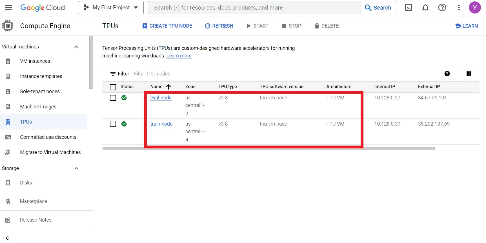

# Using TPUs on Google Cloud to fine-tune MNLI

Firstly, we do the same as *Login into a VM instance* and *Create a storage
bucket* in the [pre-training](gcp-pretrain.md) job. If these are already done,
we can use the same login VM and storage bucket.

## Create TPU nodes

Then, we create TPU nodes for fine-tuning. We use one 'v3-8' node to train and
one 'v2-8' node to evaluate, as below.



Now, we can login into each TPU node and setup by the following commands:

```
gcloud auth application-default login
gcloud auth login

pip install "jax[tpu]>=0.2.16" -f https://storage.googleapis.com/jax-releases/libtpu_releases.html

git clone --branch=main https://github.com/google-research/t5x
cd t5x
python3 -m pip install -e .
cd ..

git clone --branch=main https://github.com/google/flaxformer
cd flaxformer
pip3 install .
cd ..

git clone --branch=main https://github.com/google-research/jestimator
pip install -U scikit-learn

wget http://storage.googleapis.com/gresearch/checkpoints_in_amos_paper/archives/sentence_piece.tar.gz
tar xvfz sentence_piece.tar.gz
```

## Launch jobs

We will fine-tune a BERT-base checkpoint pre-trained by Amos.

At the 'v3-8' train node, we launch the training job as below:

```
cd jestimator
PYTHONPATH=. python3 jestimator/estimator.py \
  --module_imp="jestimator.models.bert.finetune" \
  --module_config="jestimator/models/bert/finetune.py" \
  --module_config.vocab_path="$HOME/data/sentence_piece/sp.model" \
  --module_config.segment_names="premise,hypothesis" \
  --module_config.model_config.num_labels=3 \
  --train_pattern="tfds://glue/mnli/split=train" \
  --valid_pattern="tfds://glue/mnli/split=validation_matched" \
  --model_dir="gs://jestimator_example/experiments/finetune/amos-bert-base/\
mnli/models" \
  --checkpoint_path="gs://gresearch/checkpoints_in_amos_paper/\
amos-bert-base/checkpoint_300000" \
  --train_shuffle_buf=65536 --max_train_steps=100000 \
  --train_batch_size=64 --valid_batch_size=64 --num_valid_examples=256 \
  --module_config.opt_config.optimizer="adam" \
  --module_config.opt_config.learning_rate=1e-5 \
  --check_every_steps=500 --logtostderr
```

At the 'v2-8' eval node, we launch the eval job as below:

```
cd jestimator
PYTHONPATH=. python3 jestimator/estimator.py \
  --module_imp="jestimator.models.bert.finetune" \
  --module_config="jestimator/models/bert/finetune.py" \
  --module_config.vocab_path="$HOME/data/sentence_piece/sp.model" \
  --module_config.segment_names="premise,hypothesis" \
  --module_config.model_config.num_labels=3 \
  --eval_pattern="tfds://glue/mnli/split=validation_matched" \
  --model_dir="gs://jestimator_example/experiments/finetune/amos-bert-base/\
mnli/models" \
  --mode="eval_wait" --check_ckpt_every_secs=10 --max_train_steps=100000 \
  --eval_batch_size=64 --module_config.eval_metric="accuracy" \
  --logtostderr
```

## Start TensorBoard

The setup is the same as in [pre-training](gcp-pretrain.md#tensorboard). We use
the following command to start a TensorBoard.

```
.local/bin/tensorboard dev upload \
  --logdir mnt/jestimator_example/experiments/finetune/amos-bert-base \
  --name "Finetune BERT-base" \
  --description "Example of using TPUs on Google Cloud to run JEstimator."
```

## Pre-trained checkpoints in the Amos paper

We have released the following checkpoints from the Amos paper.

Model      | Google Storage                                                                                                                                                     | Download
---------- | ------------------------------------------------------------------------------------------------------------------------------------------------------------------ | --------
BERT-base  | `gs://gresearch/checkpoints_in_amos_paper/adamw-bert-base/checkpoint_300000` <br/> `gs://gresearch/checkpoints_in_amos_paper/amos-bert-base/checkpoint_300000`     | [adamw-bert-base.tar.gz](http://storage.googleapis.com/gresearch/checkpoints_in_amos_paper/tgz/adamw-bert-base.tar.gz) <br/> [amos-bert-base.tar.gz](http://storage.googleapis.com/gresearch/checkpoints_in_amos_paper/tgz/amos-bert-base.tar.gz)
BERT-large | `gs://gresearch/checkpoints_in_amos_paper/adamw-bert-large/checkpoint_250000` <br/> `gs://gresearch/checkpoints_in_amos_paper/amos-bert-large/checkpoint_250000`   | [adamw-bert-large.tar.gz](http://storage.googleapis.com/gresearch/checkpoints_in_amos_paper/tgz/adamw-bert-large.tar.gz) <br/> [amos-bert-large.tar.gz](http://storage.googleapis.com/gresearch/checkpoints_in_amos_paper/tgz/amos-bert-large.tar.gz)
RoPE-base  | `gs://gresearch/checkpoints_in_amos_paper/adamw-rope-base/checkpoint_300000` <br/> `gs://gresearch/checkpoints_in_amos_paper/amos-rope-base/checkpoint_300000`     | [adamw-rope-base.tar.gz](http://storage.googleapis.com/gresearch/checkpoints_in_amos_paper/tgz/adamw-rope-base.tar.gz) <br/> [amos-rope-base.tar.gz](http://storage.googleapis.com/gresearch/checkpoints_in_amos_paper/tgz/amos-rope-base.tar.gz)
RoPE-large | `gs://gresearch/checkpoints_in_amos_paper/adamw-rope-large/checkpoint_1000000` <br/> `gs://gresearch/checkpoints_in_amos_paper/amos-rope-large/checkpoint_1000000` | [adamw-rope-large.tar.gz](http://storage.googleapis.com/gresearch/checkpoints_in_amos_paper/tgz/adamw-rope-large.tar.gz) <br/> [amos-rope-large.tar.gz](http://storage.googleapis.com/gresearch/checkpoints_in_amos_paper/tgz/amos-rope-large.tar.gz)
RPE-base   | `gs://gresearch/checkpoints_in_amos_paper/adamw-rpe/checkpoint_300000` <br/> `gs://gresearch/checkpoints_in_amos_paper/amos-rpe/checkpoint_300000`                 | [adamw-rpe.tar.gz](http://storage.googleapis.com/gresearch/checkpoints_in_amos_paper/tgz/adamw-rpe.tar.gz) <br/> [amos-rpe.tar.gz](http://storage.googleapis.com/gresearch/checkpoints_in_amos_paper/tgz/amos-rpe.tar.gz)
