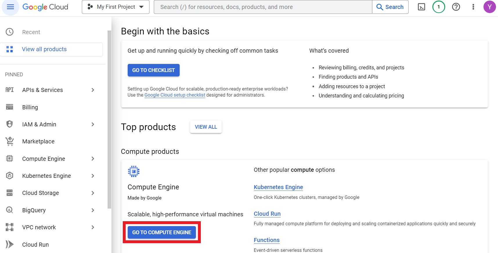
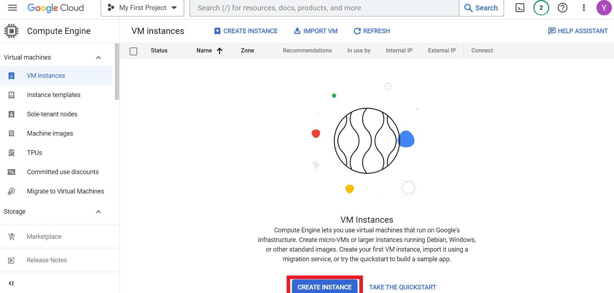
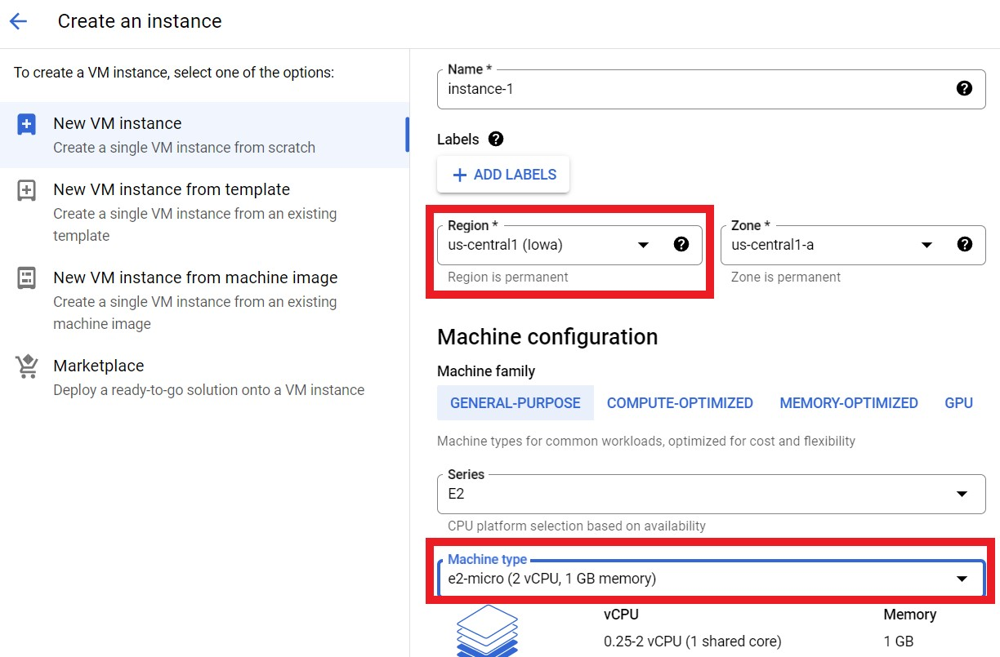
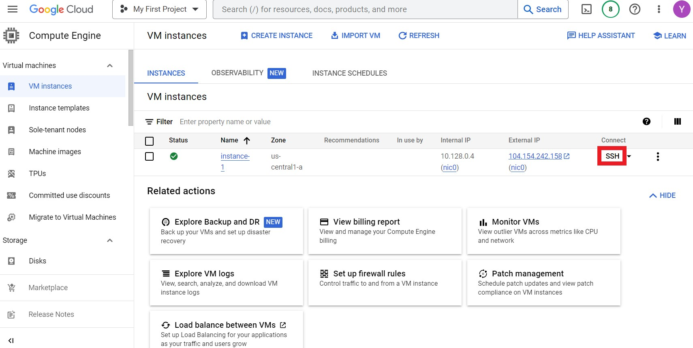
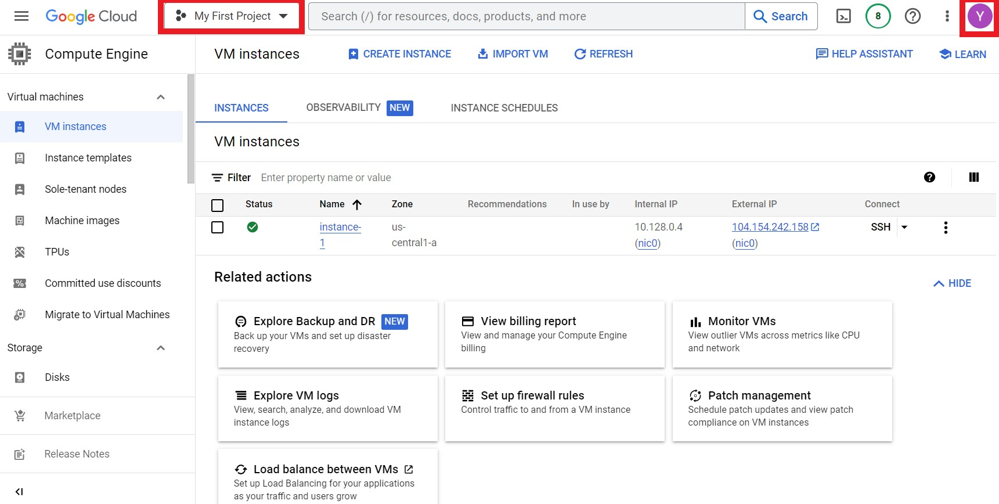
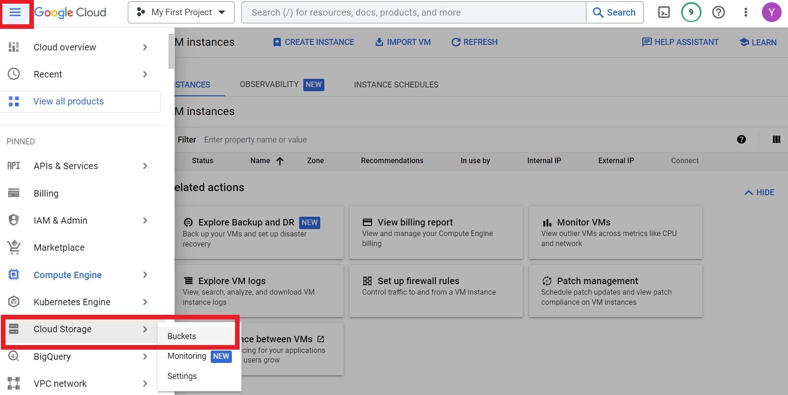
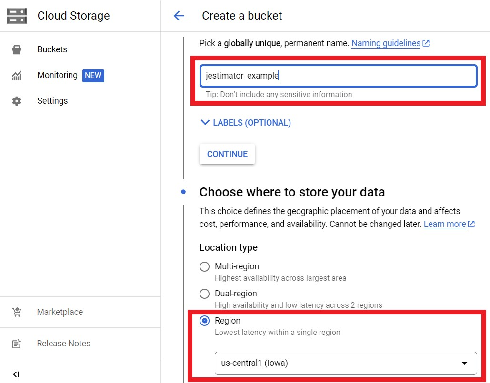
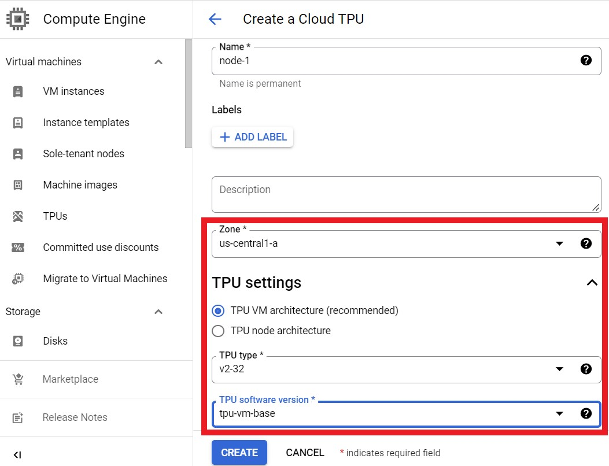

# Using TPUs on Google Cloud to pre-train BERT

## Login into a VM instance

It's not difficult to find the [Google Cloud page](https://cloud.google.com/)
and start with a Google account. It requires payment information if this is the
first time, but one gets automatic free trial credit and will not be charged.

One should land on the dashboard as below, and let's hit the "GO TO COMPUTE
ENGINE" button.



We should be able to see VM instances after installing the Compute Engine App on
Web browser. Then hit the "CREATE INSTANCE" button, as below.



We can choose the smallest e2-micro (2 vCPU, 1 GB memory) machine type, since it
will only be used to connect to TPU nodes and run TensorBoard. We may want to
choose a region where we will find our TPUs, e.g. us-central (Iowa), as shown
below.



After the Virtual Machine is created and appears on the dashboard, we hit the
"SSH" button to connect to the VM, as below.



Now we have got a Linux terminal! We can, for example, install TensorBoard using
the following command.

```
sudo apt update
sudo apt install python3-pip
pip install -U tensorboard
```

The terminal is also a Google Cloud console. We can run GCP-specific commands,
such as listing the pre-training corpus that we are going to use, already stored
in a Cloud Storage Bucket:

```
gsutil ls gs://gresearch/checkpoints_in_amos_paper/data
```

In order to connect to TPUs, we should configure the `gcloud` command in our
terminal, as below:

```
gcloud config set account your-google-account
gcloud config set project your-project-id
gcloud auth application-default login
gcloud auth login
```

In which, the google-account (e.g. xyz@gmail.com) and project-id (e.g.
graphical-quest-123456) can be found by clicking the dashboard as below.



Now, we can list the TPU nodes we have created in any zone, but currently there
is none:

```
gcloud compute tpus tpu-vm list --zone us-central1-a
```

## Create a storage bucket

We also need a storage bucket, so that the TPU node can save model checkpoints
in it, and the login VM can access the TensorBoard log as well. We hit the
dashboard menu and select 'Cloud Storage > Buckets' as below.



Then, we have to figure out a unique name for the bucket. We use
'jestimator_example' in this example. If we are sure about the region of TPUs we
are going to use, we may restrict the location of the bucket. As below.



## Create a TPU node

Now, we can create a TPU node for pre-training BERT. We hit the dashboard menu
again and select 'Compute Engine > TPUs'. For pre-training BERT, we select the
TPU type 'v2-32'. Since we are using JAX, the TPU software version should be
'tpu-vm-base'. As below.



## Login into the TPU node, install JEstimator, and launch the pre-training job

A TPU node of type 'v2-32' consists of 4 workers, while each worker has an
8-core TPUv2 board. We have to setup each TPU worker manually. To start, we have
to login into each worker once. In our terminal, we use the following command to
login into worker 0:

```
gcloud compute tpus tpu-vm ssh node-1 --zone us-central1-a --worker=0
```

And we should do the same for worker 1, 2, 3. In addition, we should do `gcloud
auth` at least on worker 0, in order to access our storage bucket during
pre-training:

```
gcloud auth application-default login
gcloud auth login
```

Then, we can use the following commands to setup all the workers at the same
time:

```
gcloud compute tpus tpu-vm ssh node-1 --zone us-central1-a --worker=all \
  --command='pip install "jax[tpu]>=0.2.16" -f https://storage.googleapis.com/jax-releases/libtpu_releases.html'

gcloud compute tpus tpu-vm ssh node-1 --zone us-central1-a --worker=all \
  --command='git clone --branch=main https://github.com/google-research/t5x'

gcloud compute tpus tpu-vm ssh node-1 --zone us-central1-a --worker=all \
  --command='cd t5x; python3 -m pip install -e .'

gcloud compute tpus tpu-vm ssh node-1 --zone us-central1-a --worker=all \
  --command='git clone --branch=main https://github.com/google/flaxformer'

gcloud compute tpus tpu-vm ssh node-1 --zone us-central1-a --worker=all \
  --command='cd flaxformer; pip3 install .'

gcloud compute tpus tpu-vm ssh node-1 --zone us-central1-a --worker=all \
  --command='git clone --branch=main https://github.com/google-research/jestimator'
```

Now, we are ready to launch the pre-training job! The following command will
pre-train a BERT-base model on the Wikipedia+Books corpus, with training
batch-size 256 and 300k training steps. It will use the Amos optimizer. Since
the job will run for a long time, it is better to start a terminal multiplexer
(e.g. GNU screen) and launch the command in it.

```
gcloud compute tpus tpu-vm ssh node-1 --zone us-central1-a --worker=all \
  --command='cd jestimator; PYTHONPATH=. python3 jestimator/estimator.py --module_imp="jestimator.models.bert.pretrain" --module_config="jestimator/models/bert/pretrain.py" --module_config.model_config.vocab_size=32000 --module_config.mask_token_id=4 --train_pattern="gs://gresearch/checkpoints_in_amos_paper/data/wikipedia-00???-of-00500,gs://gresearch/checkpoints_in_amos_paper/data/books-00???-of-00500" --valid_pattern="gs://gresearch/checkpoints_in_amos_paper/data/ptb" --train_shuffle_buf=65536 --max_train_steps=300000 --train_batch_size=256 --valid_batch_size=512 --num_valid_examples=512 --check_every_steps=5000 --module_config.opt_config.optimizer="amos" --module_config.opt_config.learning_rate=0.005 --model_dir="gs://jestimator_example/experiments/pretrain/bert-base/amos/models" --logtostderr'
```

**Caution**: One wants to check the billing information now because the
pre-training job may quickly exhaust the credit!

## Start TensorBoard

After the pre-training job starts, we can start a TensorBoard to monitor the
pre-training job. We will use
[gcsfuse](https://github.com/GoogleCloudPlatform/gcsfuse) to mount our storage
bucket to the login VM, and upload the pre-training logs to
[TensorBoard.dev](https://tensorboard.dev/).

In order to install gcsfuse:
<!-- workaround for seclinter by turning this into an HTML comment
<!--* pragma: { seclinter_this_is_fine: true } *-->

```
export GCSFUSE_REPO=gcsfuse-`lsb_release -c -s`
echo "deb https://packages.cloud.google.com/apt $GCSFUSE_REPO main" | sudo tee /etc/apt/sources.list.d/gcsfuse.list
curl https://packages.cloud.google.com/apt/doc/apt-key.gpg | sudo apt-key add -

sudo apt-get update
sudo apt-get install gcsfuse
```

<!-- workaround for seclinter by turning this into an HTML comment
<!--* pragma: { seclinter_this_is_fine: false } *-->
In order to mount the storage bucket and start TensorBoard:

```
mkdir -p mnt/jestimator_example
gcsfuse jestimator_example mnt/jestimator_example

.local/bin/tensorboard dev upload \
  --logdir mnt/jestimator_example/experiments/pretrain/bert-base \
  --name "Pretrain BERT-base" \
  --description "Example of using TPUs on Google Cloud to run JEstimator."
```
